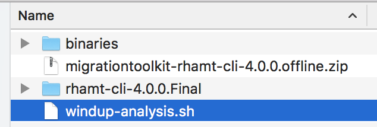

# JBoss Application Migration Batch Script

Red Hat Application Migration Toolkit (AMT). This is the tool responsable to generate reports that shows how much effort will be needed to migrate your current applications to Red Hat JBoss Application Server (EAP). 

[Click here to download AMT](https://developers.redhat.com/download-manager/file/4.0.0/migrationtoolkit-rhamt-cli-4.0.0.offline.zip)

To make it easier to collect data and generate reports from multiple applications at once I created a script *windup-analysis.sh* that iterate over all applications in *binaries* directory and generate the reports. 

All reports will be in *reports* directory.

1. Unzip  migrationtoolkit-rhamt-cli-4.0.0.offline.zip
2. Put all your binaries (war/ear/jar) in binaries directory
3. Run the script *windup-analysis.sh*

The file structure must be like this:

[More information about RHAMT here.](https://developers.redhat.com/products/rhamt/overview/)
